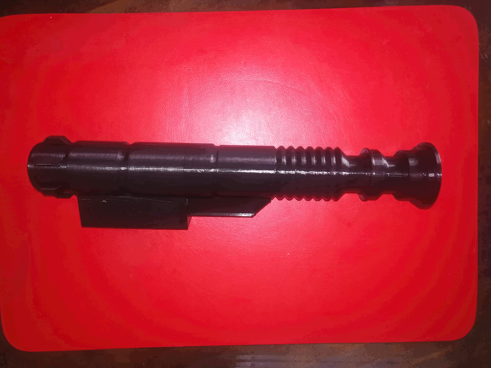
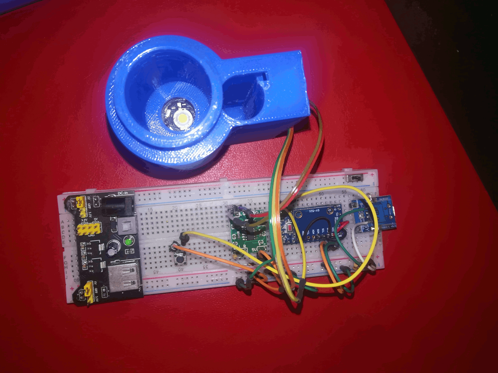
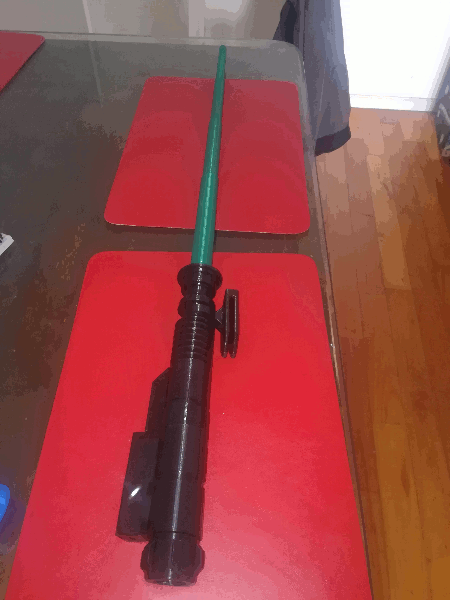

LightSaber
====
LightSaber is an open source c ++ program to control a prototype of a laser sword, tested on a board [Arduino mini](https://store.arduino.cc/usa/arduino-nano)
The board Arduino mini has an atmega328p processor

The intention is to have a code to be able to evaluate the functionalities of the prototype and decide if it is feasible to use processors of the type atmega328p. If the project advances on this code, the next version will be generated.

The schematic that was used in the prototype is in /docs/light_saber_v1.00.pdf)

The cpu is connected to an audio amplifier [PAM 8403](https://www.amazon.in/Electronicspices-PAM8403-HW-104-Digital-Amplifier/dp/B07X6H4P7X/ref=sr_1_1?dchild=1&keywords=pam+8403&qid=1603059377&s=electronics&sr=1-1),
 through a voltage divider, which acts to set the output volume. It has a transistor to control a 1W LED and an accelerometer connected by I2C [MPU 6050](https://www.ebay.com/itm/GY-521-ACELEROMETRO-GIROSCOPIO-3-EJES-MPU-6050-ARDUINO-DRONE/222179390104?_trkparms=aid%3D1110006%26algo%3DHOMESPLICE.SIM%26ao%3D1%26asc%3D225073%26meid%3D3d749cf7cdf94dba965cfc6ff296f839%26pid%3D100623%26rk%3D1%26rkt%3D5%26sd%3D221514667535%26itm%3D222179390104%26pmt%3D1%26noa%3D1%26pg%3D2047675%26algv%3DDefaultOrganic%26brand%3D-+Sin+marca%2FGen%E9rico+-&_trksid=p2047675.c100623.m-1)

To ensure the supply voltage, the battery charger was used [POWER BANK with HT4928](https://www.amazon.in/RV-USB-Charging-Circuit-Indicator/dp/B081H3T67L/ref=pd_lpo_353_img_0/258-3388245-4850734?_encoding=UTF8&pd_rd_i=B081H3T67L&pd_rd_r=ca252b08-22a7-4431-b149-0cf23170af52&pd_rd_w=P1Ejk&pd_rd_wg=Y5PuY&pf_rd_p=5a903e39-3cff-40f0-9a69-33552e242181&pf_rd_r=APQJ2ZXVV42FRDD7XHN3&psc=1&refRID=APQJ2ZXVV42FRDD7XHN3)
In the comments of the code you can see the connection pins.

The video of the project is on this [YOUTUBE CHANNEL](https://www.youtube.com/watch?v=uWwBc_w20BU&feature=youtu.be)

Some images of the project are:

The program was compiled with [Arduino Ide 1.8.13](https://www.arduino.cc/en/Main/software)

Support
-------

If you need assistance, contact me:

* Email      : educacion.ta@gmail.com

Contributing
------------
