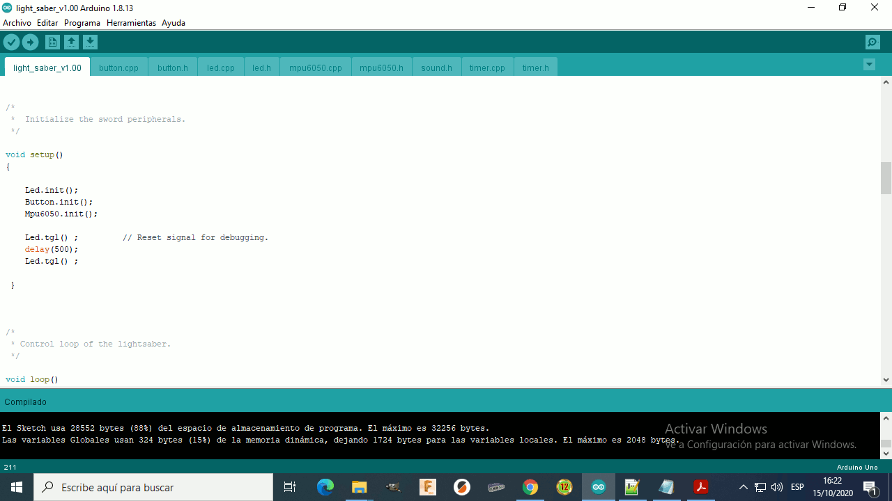

LightSaber
====
LightSaber is an open source c ++ program to control a prototype of a laser sword, tested on a printed [Arduino mini] (https://store.arduino.cc/usa/arduino-nano)
The printed Arduino board has an atmega328p processor

The intention is to have a code to be able to evaluate the functionalities of the prototype and decide if it is feasible to use processors of the type atmega328p. If the project advances on this code, the next version will be generated.

The prototype has the cpu connected to an audio amplifier, an LED controller, and an accelerator connected by I2C, in the comments of the code you can see the connection pins.

The program was compiled with [Arduino Ide] 1.8.13 (https://www.arduino.cc/en/Main/software)

Support
-------

If you need assistance, contact me:

* Email      : eduacacion.ta@gmail.com

Contributing
------------
